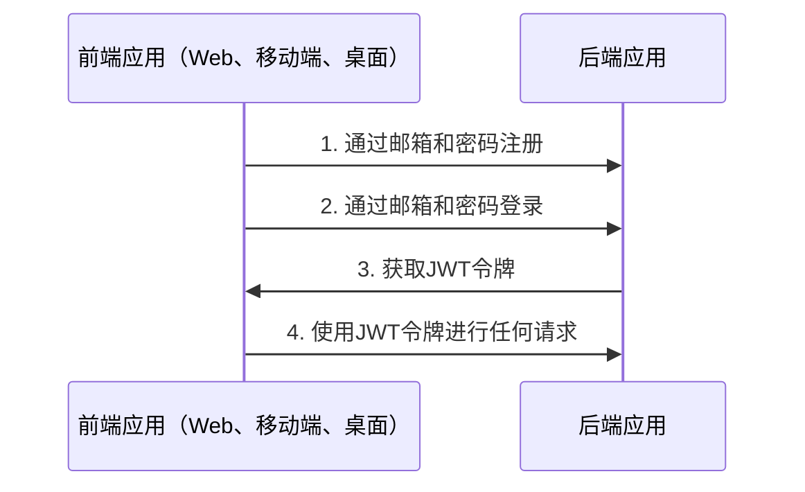
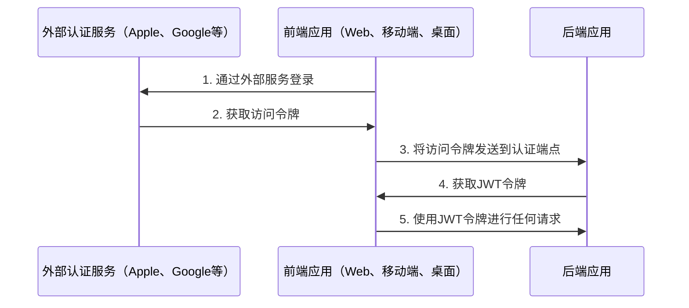

# 认证

## 目录 <!-- omit in toc -->

- [基本信息](#基本信息)
  - [通过邮箱认证流程](#通过邮箱认证流程)
  - [通过外部服务或社交网络认证流程](#通过外部服务或社交网络认证流程)
- [配置认证](#配置认证)
- [通过Apple认证](#通过apple认证)
- [通过Facebook认证](#通过facebook认证)
- [通过Google认证](#通过google认证)
- [通过Twitter认证](#通过twitter认证)
- [关于JWT策略](#关于jwt策略)
- [刷新令牌流程](#刷新令牌流程)
  - [视频示例](#视频示例)
  - [支持多设备登录/会话](#支持多设备登录会话)
- [登出](#登出)
- [问答](#问答)
  - [在调用`POST /api/v1/auth/logout`或从数据库中删除会话后，用户仍然可以使用`access token`进行一段时间的请求。为什么？](#在调用post-apiv1authlogout或从数据库中删除会话后用户仍然可以使用access-token进行一段时间的请求为什么)

---

## 基本信息

### 通过邮箱认证流程

默认情况下，样板使用邮箱和密码进行登录和注册。



<https://user-images.githubusercontent.com/6001723/224566194-1c1f4e98-5691-4703-b30e-92f99ec5d929.mp4>

### 通过外部服务或社交网络认证流程

你也可以通过其他外部服务或社交网络（如Apple、Facebook、Google和Twitter）进行注册。



要通过外部服务或社交网络进行认证，你需要：

1. 通过外部服务登录并获取访问令牌。
1. 在前端应用中调用以下端点之一，并传递第一步获取的访问令牌，从后端应用获取JWT令牌。

   ```text
   POST /api/v1/auth/facebook/login

   POST /api/v1/auth/google/login

   POST /api/v1/auth/twitter/login

   POST /api/v1/auth/apple/login
   ```

1. 使用JWT令牌进行任何请求

---

## 配置认证

1. 生成`access token`和`refresh token`的密钥：

   ```bash
   node -e "console.log('\nAUTH_JWT_SECRET=' + require('crypto').randomBytes(256).toString('base64') + '\n\nAUTH_REFRESH_SECRET=' + require('crypto').randomBytes(256).toString('base64') + '\n\nAUTH_FORGOT_SECRET=' + require('crypto').randomBytes(256).toString('base64') + '\n\nAUTH_CONFIRM_EMAIL_SECRET=' + require('crypto').randomBytes(256).toString('base64'));"
   ```

1. 打开`/.env`文件，将`AUTH_JWT_SECRET`和`AUTH_REFRESH_SECRET`替换为第一步生成的密钥。

   ```text
   AUTH_JWT_SECRET=第一步生成的密钥
   AUTH_REFRESH_SECRET=第一步生成的密钥
   ```

## 通过Apple认证

1. [在Apple上设置你的服务](https://www.npmjs.com/package/apple-signin-auth)
1. 修改`.env`中的`APPLE_APP_AUDIENCE`

   ```text
   APPLE_APP_AUDIENCE=["com.company", "com.company.web"]
   ```

## 通过Facebook认证

1. 访问 https://developers.facebook.com/apps/creation/ 并创建一个新应用
   

   
2. 进入`设置` -> `基本`，从你的应用中获取`App ID`和`App Secret`
   
3. 修改`.env`中的`FACEBOOK_APP_ID`和`FACEBOOK_APP_SECRET`

   ```text
   FACEBOOK_APP_ID=123
   FACEBOOK_APP_SECRET=abc
   ```

## 通过Google认证

1. 你需要`CLIENT_ID`和`CLIENT_SECRET`。你可以通过访问[开发者控制台](https://console.cloud.google.com/)，点击你的项目（如果没有，请在此处创建 https://console.cloud.google.com/projectcreate） -> `API和服务` -> `凭据`来找到这些信息。
1. 修改`.env`中的`GOOGLE_CLIENT_ID`和`GOOGLE_CLIENT_SECRET`

   ```text
   GOOGLE_CLIENT_ID=abc
   GOOGLE_CLIENT_SECRET=abc
   ```

## 通过Twitter认证

1. 在Twitter上设置你的服务
1. 修改`.env`中的`TWITTER_CONSUMER_KEY`和`TWITTER_CONSUMER_SECRET`

   ```text
   TWITTER_CONSUMER_KEY=abc
   TWITTER_CONSUMER_SECRET=abc
   ```

## 关于JWT策略

在`src/auth/strategies/jwt.strategy.ts`文件的`validate`方法中，你可以看到我们没有检查用户是否存在于数据库中，因为这是多余的，它可能会失去JWT方法的优势，并可能影响应用程序的性能。

为了更好地理解JWT的工作原理，请观看视频解释 https://www.youtube.com/watch?v=Y2H3DXDeS3Q 并阅读这篇文章 https://jwt.io/introduction/

```typescript
// src/auth/strategies/jwt.strategy.ts

@Injectable()
export class JwtStrategy extends PassportStrategy(Strategy, 'jwt') {
  // ...

  public validate(payload) {
    if (!payload.id) {
      throw new UnauthorizedException();
    }

    return payload;
  }
}
```

> 如果你需要获取完整的用户信息，请在服务中获取。

## 刷新令牌流程

1. 在登录时（`POST /api/v1/auth/email/login`），你将在响应中收到`token`、`tokenExpires`和`refreshToken`。
1. 在每个常规请求中，你需要在`Authorization`头中发送`token`。
1. 如果`token`已过期（在客户端应用中检查`tokenExpires`属性），你需要将`refreshToken`发送到`POST /api/v1/auth/refresh`的`Authorization`头中以刷新`token`。你将在响应中收到新的`token`、`tokenExpires`和`refreshToken`。

### 视频示例

https://github.com/brocoders/nestjs-boilerplate/assets/6001723/f6fdcc89-5ec6-472b-a6fc-d24178ad1bbb

### 支持多设备登录/会话

样板支持通过刷新令牌流程实现多设备登录。这是通过`sessions`实现的。当用户登录时，会在数据库中创建一个新的会话。会话记录包含`sessionId (id)`、`userId`和`hash`。

在每个`POST /api/v1/auth/refresh`请求中，我们会检查数据库中的`hash`与刷新令牌中的`hash`是否匹配。如果匹配，我们返回新的`token`、`tokenExpires`和`refreshToken`。然后我们更新数据库中的`hash`，以防止使用之前的刷新令牌。

## 登出

1. 调用以下端点：

   ```text
   POST /api/v1/auth/logout
   ```

2. 从你的客户端应用（cookies、localStorage等）中删除`access token`和`refresh token`。

## 问答

### 在调用`POST /api/v1/auth/logout`或从数据库中删除会话后，用户仍然可以使用`access token`进行一段时间的请求。为什么？

这是因为我们使用了`JWT`。`JWT`是无状态的，所以我们无法撤销它们，但不用担心，这是正确的行为，访问令牌将在`AUTH_JWT_TOKEN_EXPIRES_IN`指定的时间后过期（默认值为15分钟）。如果你仍然需要立即撤销`JWT`令牌，你可以在每次请求时检查[jwt.strategy.ts](https://github.com/brocoders/nestjs-boilerplate/blob/2896589f52d2df025f12069ba82ba4fac1db8ebd/src/auth/strategies/jwt.strategy.ts#L20-L26)中是否存在会话。但是，不建议这样做，因为它可能会影响应用程序的性能。

---

上一节: [数据库操作](database.md)

下一节: [序列化](serialization.md)
