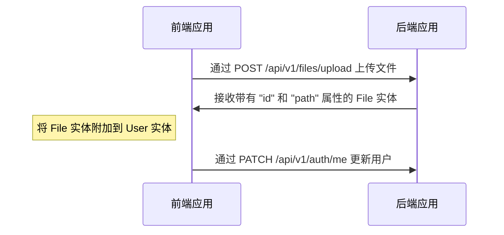
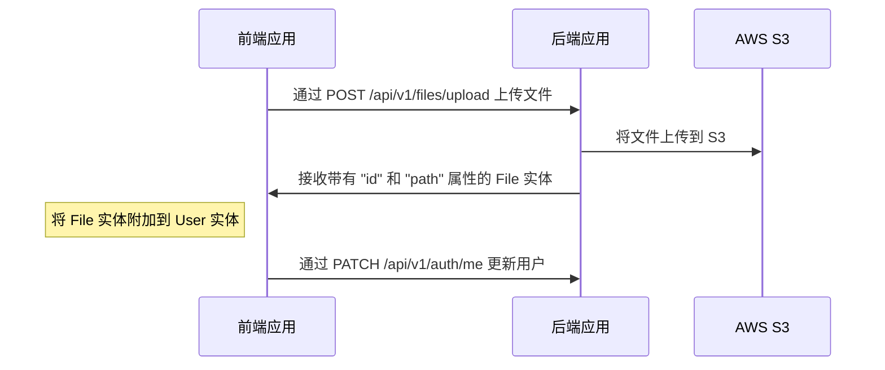
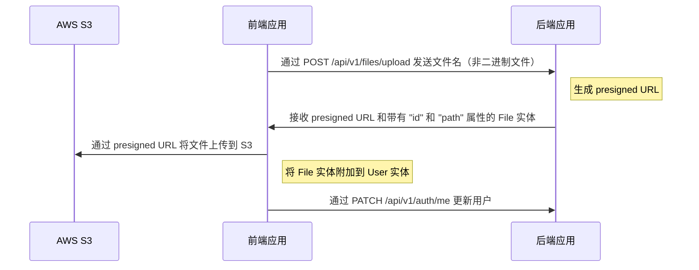

# 文件上传

---

## 目录 <!-- omit in toc -->

- [支持的驱动](#支持的驱动)
- [使用 `local` 驱动的文件上传和附加流程](#使用-local-驱动的文件上传和附加流程)
  - [上传头像到用户资料的示例（本地）](#上传头像到用户资料的示例本地)
  - [视频示例](#视频示例)
- [使用 `s3` 驱动的文件上传和附加流程](#使用-s3-驱动的文件上传和附加流程)
  - [配置 `s3` 驱动](#配置-s3-驱动)
  - [上传头像到用户资料的示例（S3）](#上传头像到用户资料的示例s3)
- [使用 `s3-presigned` 驱动的文件上传和附加流程](#使用-s3-presigned-驱动的文件上传和附加流程)
  - [配置 `s3-presigned` 驱动](#配置-s3-presigned-驱动)
  - [上传头像到用户资料的示例（S3 Presigned URL）](#上传头像到用户资料的示例s3-presigned-url)
- [如何删除文件？](#如何删除文件)

---

## 支持的驱动

开箱即用的样板支持以下驱动：`local`、`s3` 和 `s3-presigned`。你可以在 `.env` 文件中设置 `FILE_DRIVER` 变量。如果你想使用其他服务来存储文件，可以扩展它。

> 对于生产环境，我们建议使用 "s3-presigned" 驱动来减轻服务器负担。

---

## 使用 `local` 驱动的文件上传和附加流程

端点 `/api/v1/files/upload` 用于上传文件，返回带有 `id` 和 `path` 的 `File` 实体。收到 `File` 实体后，你可以将其附加到另一个实体。

### 上传头像到用户资料的示例（本地）



### 视频示例

<https://user-images.githubusercontent.com/6001723/224558636-d22480e4-f70a-4789-b6fc-6ea343685dc7.mp4>

## 使用 `s3` 驱动的文件上传和附加流程

端点 `/api/v1/files/upload` 用于上传文件，返回带有 `id` 和 `path` 的 `File` 实体。收到 `File` 实体后，你可以将其附加到另一个实体。

### 配置 `s3` 驱动

1. 打开 https://s3.console.aws.amazon.com/s3/buckets
1. 点击 "Create bucket"
1. 创建 bucket（例如 `your-unique-bucket-name`）
1. 打开你的 bucket
1. 点击 "Permissions" 标签
1. 找到 "Cross-origin resource sharing (CORS)" 部分
1. 点击 "Edit"
1. 粘贴以下配置

   ```json
   [
     {
       "AllowedHeaders": ["*"],
       "AllowedMethods": ["GET"],
       "AllowedOrigins": ["*"],
       "ExposeHeaders": []
     }
   ]
   ```

1. 点击 "Save changes"
1. 更新 `.env` 文件中的以下变量：

   ```dotenv
   FILE_DRIVER=s3
   ACCESS_KEY_ID=YOUR_ACCESS_KEY_ID
   SECRET_ACCESS_KEY=YOUR_SECRET_ACCESS_KEY
   AWS_S3_REGION=YOUR_AWS_S3_REGION
   AWS_DEFAULT_S3_BUCKET=YOUR_AWS_DEFAULT_S3_BUCKET
   ```

### 上传头像到用户资料的示例（S3）



## 使用 `s3-presigned` 驱动的文件上传和附加流程

端点 `/api/v1/files/upload` 用于上传文件。在这种情况下，`/api/v1/files/upload` 只接收 `fileName` 属性（不带二进制文件），并返回 `presigned URL` 和带有 `id` 和 `path` 的 `File` 实体。收到 `presigned URL` 和 `File` 实体后，你需要将文件上传到 `presigned URL`，然后将 `File` 附加到另一个实体。

### 配置 `s3-presigned` 驱动

1. 打开 https://s3.console.aws.amazon.com/s3/buckets
1. 点击 "Create bucket"
1. 创建 bucket（例如 `your-unique-bucket-name`）
1. 打开你的 bucket
1. 点击 "Permissions" 标签
1. 找到 "Cross-origin resource sharing (CORS)" 部分
1. 点击 "Edit"
1. 粘贴以下配置

   ```json
   [
     {
       "AllowedHeaders": ["*"],
       "AllowedMethods": ["GET", "PUT"],
       "AllowedOrigins": ["*"],
       "ExposeHeaders": []
     }
   ]
   ```

   对于生产环境，我们建议使用更严格的配置：

   ```json
   [
     {
       "AllowedHeaders": ["*"],
       "AllowedMethods": ["PUT"],
       "AllowedOrigins": ["https://your-domain.com"],
       "ExposeHeaders": []
     },
     {
       "AllowedHeaders": ["*"],
       "AllowedMethods": ["GET"],
       "AllowedOrigins": ["*"],
       "ExposeHeaders": []
     }
   ]
   ```

1. 点击 "Save changes"
1. 更新 `.env` 文件中的以下变量：

   ```dotenv
   FILE_DRIVER=s3-presigned
   ACCESS_KEY_ID=YOUR_ACCESS_KEY_ID
   SECRET_ACCESS_KEY=YOUR_SECRET_ACCESS_KEY
   AWS_S3_REGION=YOUR_AWS_S3_REGION
   AWS_DEFAULT_S3_BUCKET=YOUR_AWS_DEFAULT_S3_BUCKET
   ```

### 上传头像到用户资料的示例（S3 Presigned URL）



## 如何删除文件？

我们倾向于不删除文件，因为这可能会在恢复数据时带来负面体验。出于这个原因，我们在数据库中也使用了[软删除](https://orkhan.gitbook.io/typeorm/docs/delete-query-builder#soft-delete)方法。但是，如果你需要删除文件，可以创建自己的处理程序、cronjob 等。

---

上一节: [序列化](serialization.md)

下一节: [测试](tests.md)
